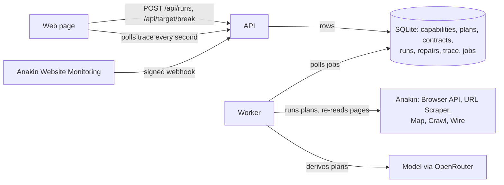

# Anvil

An agent that operates websites, and when a site changes under it, throws its plan away, works out a new one from the live page, and keeps it only if the result still passes the contract it learned the first time.

**Try it: https://attirebytatsavi.com** — no key, no sign-up, no install.

1. Run *Reserve a study room*. Anvil books a real room on the demo site through a remote browser and reads back the confirmation.
2. Break the site with one of the four buttons: rename a field, add a review step, move seats onto their own page, or rebuild the confirmation page.
3. Run it again. The run fails, triage calls it structural, a repair derives a new plan, checks it against the contract, promotes it, and the same booking goes through.

Everything shows up as a trace: every step, decision, diff and model call, in order. The demo site belongs to this project. That is on purpose: you cannot show an agent surviving a site change on a site you are not allowed to change.

## What it does

A **capability** is a goal plus a cached **plan**: ordered steps (`navigate`, `fill`, `click`, `submit`, `assert`, `extract`). Running a cached plan is cheap and fast; working a plan out from a live page takes several model calls and a minute. That asymmetry is why plans are cached, and it is also why a site change is dangerous: the cached plan is the thing that breaks.

When a run fails, Anvil does not patch the selector that failed. It re-derives the whole plan from the goal, the live page, what changed since the plan was made, and the page the old plan got stuck on. A renamed field, a new review page, a reordered flow and a rebuilt confirmation page all go through the same loop.

The first good run leaves behind a **contract**: required fields, their types, a minimum record count, numeric bounds, and which fields must echo the inputs (the booking name must be the name that was typed in). A repaired plan is promoted only if its result passes that contract. Non-empty is not correct — a plan can happily extract a navigation menu.

## How it works



- **API** (`src/api.mjs`, plain `node:http`): validates input, writes rows, serves the page. It never does long work.
- **Worker** (`src/worker.mjs`): the only process that talks to Anakin or the model. One job at a time, with a heartbeat lease so a crashed worker's job is picked up again and a live one is never stolen.
- **Trace** (`TraceEvent` rows): what the page renders. Page structure goes into it, raw page HTML never does.
- **Stack:** Node 22, Prisma 7 on SQLite, Playwright (only as the CDP client for Anakin's browser), no frontend framework. Deployed on one VM behind Caddy and Cloudflare.

### Failure triage

Every failed run is classified before anything is repaired. Repairing on every failure burns credits and throws away plans that were fine.

| Signal | Kind | What happens |
|---|---|---|
| Network trouble, 429, 5xx, a navigation that never loads, Anakin with no browser free | transient | Retried in the same job after 2s and 4s. The plan is not touched. |
| 403, a captcha or "access denied" page, robots.txt says no | blocked | Capability marked `degraded`. Never repaired: a new plan cannot fix a block. |
| The page rendered (its canary element is there) but a step failed or the contract failed | structural | A repair is queued. |
| The page rendered, the only problem is zero records | empty | The run succeeds with an empty result. |

### The repair loop

`src/repair.mjs`, triggered by a structural failure, a monitor webhook, or a person.

1. Mark the capability `repairing`.
2. Re-read the live entry page and diff its structure against the snapshot the old plan was derived from ("field `email` is gone; an email field `contact_email` sits in the same position, likely a rename").
3. Ask the model for a new plan from the goal, the old plan, how it failed, the diff, the live page and the page the old plan got stuck on.
4. Reject plans that are not runnable, run the candidate for real, and check the result against the contract.
5. Pass: promote it as the next version, mark `healthy`. Fail: feed back what went wrong (including the page the candidate got stuck on) and try again, with backoff.
6. After three failed attempts, keep the old plan, mark `degraded`, and say so. A degraded capability will not repair itself again until someone asks.

Running out of Anakin credits or model requests stops a repair as `capped` instead: that says nothing about the site, so the capability is not degraded for it.

### Proactive repair

Anakin Website Monitoring watches a read-only view of the demo site's entry page (`/harbor-lane/`). When it sees a change it posts a signed alert to `/api/hooks/site-changed`. Anvil checks the HMAC signature and timestamp, ignores retries of a delivery it has already handled, and queues a repair. The page picks the repair up on its own, before any run has failed.

### Reading any (allowlisted) site

The *Read another site* form turns a URL and a sentence into a read capability (`src/derive-read.mjs`):

1. Allowlist and robots.txt check (RFC 9309 matching, `AnvilBot` or `*` group).
2. **Wire first.** If one of Anakin's 963 Wire catalogs covers the domain, `resolve-actions` ranks its actions for the goal, the model picks one that needs no login and fills its parameters, and a result with real records makes it the plan. No derivation.
3. Otherwise **Map** the site, rank its links by the goal's words, and when URLs say nothing (`/pages/simple/`, `/table/?from=USD`) **Crawl** the entry page and let the model shortlist from the links' anchor text.
4. **Crawl** from the best candidate and have the model pick the page that holds the data.
5. **Scrape** that page as markdown, HTML and a screenshot.
6. The model writes a `navigate` / `assert` / `extract` plan (with `each` for lists) against trimmed HTML. It is dry-run on the scraped page before a credit is spent running it, with problems fed back for up to three tries.
7. A fresh read through the normal runner gives the golden sample and the contract.

## How Anvil uses Anakin

| Product | What Anvil does with it | What breaks without it |
|---|---|---|
| **Browser API** | Every step of the booking plan runs in Anakin's remote Chromium over CDP. Repairs re-read the live page and try candidate plans in the same session. | Nothing can book anything, so there is nothing to break or repair. The write path is gone. |
| **URL Scraper** | Read capabilities: the operative page is scraped as markdown, HTML and a screenshot to derive from, and every read run is a fresh scrape with the 24-hour cache bypassed. | Read capabilities have no page to plan against and no way to run. |
| **Map** | Lists a site's URLs so a goal can be matched to the page that actually holds the data. | Anvil can only read the exact page someone pastes. |
| **Crawl** | Samples candidate pages, and reads the entry page's link text when URLs are meaningless. | The page choice is a guess from URLs alone. On scrapethissite.com that guess picked the wrong page; the countries list sits at `/pages/simple/`. |
| **Wire catalog + resolve-actions** | Checked before any derivation: domain match against the catalog, then resolve-actions ranks actions for the goal. | Anvil spends a minute of model calls deriving plans for sites Anakin already solved. |
| **Wire execute-task + get-job** | Runs the chosen prebuilt action (for Hacker News, `hn_stories`) as the capability's plan, on every run. | Covered sites fall back to slower, more fragile derived plans. |
| **Website Monitoring** | Watches the demo site; a change starts a repair before anyone's run fails. | Repair only ever happens after a run has already failed in front of someone. |
| **Webhooks** | The monitor's HMAC-signed alert is what wakes Anvil up. | Anvil would have to poll for changes, or wait for a failure. |

Not used, and not claimed: Search, Agentic Search, Browser Sessions, and Wire's create-build-request.

Costs are recorded in a ledger at Anakin's published prices (there is no balance endpoint) and a global hourly cap is checked before every call. Past the cap, runs are refused and the page replays a recorded real run, labelled as a recording.

## Prior art

Self-healing web automation is not a new idea, and Anvil does not claim it is.

- **[Stagehand](https://docs.stagehand.dev/v3/basics/act)** caches browser actions so repeat runs skip the model, and calls the model again when a cached action fails on a changed page.
- **[Kadoa](https://www.kadoa.com/blog/autogenerate-self-healing-web-scrapers)** generates scrapers with a model and regenerates selectors when sites change.
- **[AgentLayer](https://dev.to/farhanrhine/how-i-turned-any-website-into-an-mcp-server-and-what-i-learned-building-it-1jpm)** crawls a URL, has a model generate MCP tool definitions, and validates each tool in a sandbox before serving it. Its write-up names site changes as what makes scraping brittle, and does not describe what happens when a generated tool breaks after a site update.

What Anvil adds, concretely:

- **The unit of repair is the whole plan, across pages,** re-derived from the goal. A new review page or a reordered flow is not a broken selector; it needs steps that did not exist before.
- **A repair is only kept if it passes a contract learned from the first good run** — types, bounds, record counts, and fields that must echo the inputs. Failed repairs roll back and the capability says it is degraded.
- **Triage before repair.** A network blip, a bot block and an empty result are not repaired; only structural failures are, and a degraded capability stops trying.
- **Repair can start before anything fails,** from a Website Monitoring webhook.
- **Anyone can watch it happen on the deployed site,** break it themselves, and read every decision in the trace.

## What was verified, and when

All on 2026-09-13, through the HTTP API or the deployed page.

- **All four break kinds, stacked** (`npm run breaks`): each made the next run fail as structural, each repair passed the contract (the reordered flow and the rebuilt confirmation page needed their third attempt), and each following run succeeded.
- **Deployed arc** from a fresh browser profile: run, add a review step, run fails, repair promotes v2 in 34s, run succeeds.
- **Proactive repair**: renamed a field, asked the monitor to check, change detected in 4s, signed webhook, the page showed the repair with no clicks, v2 promoted 34s later.
- **Triage** live: target stopped → transient, three tries, plan untouched; a real 403 → blocked and degraded; a degraded capability with a structural failure → no repair queued.
- **Read capabilities** from sites never touched before: python.org upcoming events, x-rates.com USD rates, scrapethissite.com countries, quotes.toscrape.com quotes (all derived), and news.ycombinator.com via Wire's `hn_stories`. lobste.rs was refused before any credit was spent: its robots.txt disallows everything.
- **Crash recovery**: a worker killed mid-repair had its job reclaimed and finished by a new worker.

## Limitations

- **Free models.** Plans come from free models through OpenRouter. A call takes 10 to 130 seconds, each account gets roughly 50 requests a day, and one of them sometimes answers with nothing. A repair can take a couple of minutes and, on a bad day, fail and degrade. Running out of requests stops repairs as `capped`.
- **The demo site is not on the public internet for runs.** Anakin's browser loads a made-up origin (`harbor-lane.anvil.test`) and the worker answers those requests from the site running on the same machine. `/harbor-lane/` is a read-only public view for the monitor. So repairs re-read the page through the browser; the URL Scraper re-read path for public targets is written but was not exercised.
- **Read capabilities are not repaired automatically yet.** Their runs are triaged, but a structural failure is only reported.
- **Contracts on changing lists can be too strict.** The Hacker News capability requires a `url` on every story; an "Ask HN" post on the front page would fail it.
- **A step can time out on a page that did not change.** Seen twice in testing, cause unknown. It is triaged as structural and triggers a repair that was not needed. The page structure at failure is stored to diagnose it.
- **The credit cap is an estimate** from published prices, and a browser session that runs past two minutes can overshoot it by a credit. Screenshots from the scraper are sometimes missing.
- **One shared demo.** One worker does one job at a time, everyone sees the same demo site, and a reset puts it back for everyone. Breaks are limited per IP and refused while something is running.
- **The monitor checks every four hours** to keep credits down. The proactive demo above used an on-demand check.
- **Crawl's `includePatterns` only filter the first few links it discovers,** so Anvil starts crawls at the page it wants instead.

## Running it yourself

Needs Node 22 with type stripping on by default (the generated Prisma client is TypeScript; tested on 22.22 and 22.23), an [Anakin](https://anakin.io) API key and an [OpenRouter](https://openrouter.ai) key.

```bash
git clone https://github.com/shivang-goliyan/anvil.git && cd anvil
npm ci                      # also generates the Prisma client
cp .env.example .env        # fill in the keys; see the comments in the file
npm run db:migrate
npm run seed

npm run target              # the demo site on :4310
npm run api                 # the page and API on :3310
npm run worker              # runs, repairs, derivations
```

Open http://localhost:3310. Useful `.env` values: `LLM_MODEL` takes a comma-separated fallback list (for example `nex-agi/nex-n2.5-pro:free,nvidia/nemotron-3-super-120b-a12b:free`), `TARGET_ADMIN_TOKEN` is any long random string, `ALLOWED_SITES` lists the domains read capabilities may touch.

Checks and scripts:

```bash
npm test                    # triage, robots.txt, extraction, Wire records
npm run phase2              # run -> break -> fail -> repair -> run, through the API
npm run breaks              # all four break kinds, stacked
npm run phase3 -- "https://quotes.toscrape.com/|the quotes with their author and tags"
npm run monitor -- create https://your.domain   # needs the site to be public
```

Deployment: `deploy/` has the three systemd units and the Caddy block used for the live site. Leave `TARGET_URL` empty to keep the demo site private and forwarded into Anakin's browser.

## Conduct

- robots.txt and a domain allowlist are checked before every third-party fetch, including the ones Anakin makes for us.
- Public endpoints are rate limited by IP; breaking the demo site more strictly than anything else.
- No credentials are collected or stored anywhere. No logged-in third-party sites.
- The page never shows raw scraped HTML: structure and extracted values only.
- A global hourly Anakin credit cap, with a clearly labelled recorded run past it.

## Layout

```
src/            api, worker, run and repair loops, derivation, triage, contract, Anakin client, conduct
target/         the demo site and its break kinds
web/            the page
capabilities/   the hand-written first plan for the booking capability
prisma/         schema and migrations
scripts/        checkpoints, seeding, recording the demo run, monitor setup
deploy/         systemd units and Caddy block
demo/           the recorded run replayed past the credit cap
```
