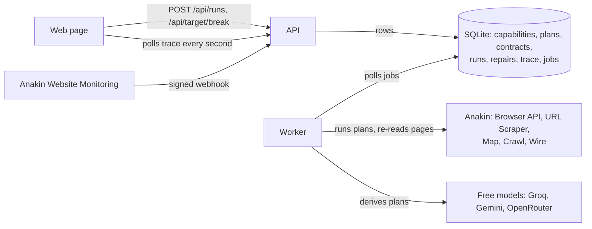

# Anvil

An agent that operates websites, and when a site changes under it, throws its plan away, works out a new one from the live page, and keeps it only if the result still passes the contract it learned the first time.

**Try it: https://anvil.kgbnetwork.com** — no key, no sign-up, no install. (The same app also answers at https://attirebytatsavi.com, where the Website Monitoring demo below was set up.)

1. Press **Send Anvil to book it**. Anvil picks the room, date and time, books it on the demo site through a remote browser, reads the confirmation, then looks the booking up on the site's own "Find my booking" page to check what was really stored. The page shows each step in plain words, with screenshots of what the remote browser actually saw.
2. Break the site. **Surprise me** applies two or three changes picked and named at random on the spot (a field renamed to something like `inbox_q7x`, the fields shuffled, the form's id and button changed, the confirmation page's ids renamed), so nobody, including whoever wrote the demo, scripted that exact change. Or pick a specific break: rename a field, add a review step, move seats onto their own page, rebuild the confirmation page, switch booking references to a new format, or make the site quietly book a different room than the one asked for. Or **change it your way**: type a new label for any box (its name follows the label), new button text, or a new order, so the change is one nobody could have prepared for.
3. Run it again. The run fails, triage calls it structural, a repair derives a new plan, rehearses it up to the booking button without pressing it, tests the steps after booking on a booking that already exists, promotes it, and then makes the one real booking. The repair opens with two screenshots side by side: what the last good booking saw at the step that broke, and what the broken one saw there instead.

The demo is shared, so everyone with the page open sees every booking, change and repair as it happens, marked when it is someone else's. Below the demo, the same page reads real websites (Hacker News through a Wire action, quotes.toscrape.com through a derived plan) with one click, and can be taught a new one.

Everything shows up in order, in plain words first (what changed on the site, the new steps, the check the booking passed) with the code, selectors and raw trace one click away. The demo site belongs to this project. That is on purpose: you cannot show an agent surviving a site change on a site you are not allowed to change.

## What it does

A **capability** is a goal plus a cached **plan**: ordered steps (`navigate`, `fill`, `click`, `submit`, `assert`, `extract`). Running a cached plan is cheap and fast; working a plan out from a live page takes several model calls and a minute. That asymmetry is why plans are cached, and it is also why a site change is dangerous: the cached plan is the thing that breaks.

When a run fails, Anvil does not patch the selector that failed. It re-derives the whole plan from the goal, the live page, what changed since the plan was made, and the page the old plan got stuck on. A renamed field, a new review page, a reordered flow and a rebuilt confirmation page all go through the same loop.

The first good run leaves behind a **contract** in two tiers. **Invariants** are never relaxed: required fields, their types, a minimum record count, fields that must echo the inputs (the booking name must be the name that was typed in), and fields that must agree with each other (the room on the confirmation page must be the room the site's own records hold, read back separately). **Learned details** may legitimately change: numeric ranges and the shape of codes such as booking references. When only a detail moves and every invariant holds, the contract is amended ("check updated") instead of the capability being called broken. A repaired plan is promoted only if its result passes. Non-empty is not correct — a plan can happily extract a navigation menu, and a site can confirm the room you asked for while storing another one.

**Doing things safely.** A plan that books marks exactly one step as the commit (the button that makes the booking). A normal run reads the form back right before pressing it. A repair never presses it: it rehearses the candidate up to that step and checks every input is on the page, then runs only the steps after it on a booking that already exists (the one the failed run made, or the last good one). If the failed run had already booked, that booking is read back instead of made again; if it had not, the repair queues exactly one real booking with the new plan, and if that one fails the capability is marked as needing a person instead of repairing again. A run that fails after the commit is never retried. On the demo site, bookings are counted on the site's side before and after each repair.

## How it works



- **API** (`src/api.mjs`, plain `node:http`): validates input, writes rows, serves the page. It never does long work.
- **Worker** (`src/worker.mjs`): the only process that talks to Anakin or the model. One job at a time, with a heartbeat lease so a crashed worker's job is picked up again and a live one is never stolen.
- **Trace** (`TraceEvent` rows): what the page renders. Page structure goes into it, raw page HTML never does.
- **Stack:** Node 22, Prisma 7 on SQLite, Playwright (only as the CDP client for Anakin's browser), no frontend framework. Deployed on one VM behind Caddy and Cloudflare.

### Failure triage

Every failed run is classified before anything is repaired. Repairing on every failure burns credits and throws away plans that were fine.

| Signal | Kind | What happens |
|---|---|---|
| Network trouble, 429, 5xx, a navigation that never loads, Anakin with no browser free | transient | Retried in the same job after 2s and 4s. The plan is not touched. |
| 403, a captcha or "are you a robot" page, "access denied", robots.txt says no | blocked | Capability marked `degraded`. Never repaired: a new plan cannot fix a block, and Anvil does not solve captchas. A fit check that rehearses up to a booking button next to a captcha says blocked too. |
| The page rendered (its canary element is there, or for a read the page came back full of text) but a step failed or the contract failed | structural | A repair is queued. |
| The page rendered, the only problem is zero records | empty | The run succeeds with an empty result. |
| The form held every input when the booking was made, and only the site's own stored record disagrees | mismatch | Reported. Not repaired: a new plan cannot fix a site that books the wrong thing. |

### The repair loop

`src/repair.mjs`, triggered by a structural failure, a monitor webhook, the page's "check the website now" button, or a person.

0. **Only on a real change.** When nothing has failed (a monitor alert, the button, a person), a fit check runs first (`src/fit.mjs`), with no model and no booking: every saved selector the first page needs is looked for on the live page, the saved steps are rehearsed up to the booking button, and the steps after it are run on the last good booking and checked against the contract. If the saved steps still fit, the repair ends as `not-needed`, the page it was checked on becomes the new snapshot, and a capability that was `degraded` is `healthy` again. If they do not fit, the page they stopped on goes to the model with the rest. A block ends it as blocked, and a check that could not tell (the page did not load) changes nothing.
1. Mark the capability `repairing`.
2. Re-read the live entry page and diff its structure against the snapshot the old plan was derived from ("field `email` is gone; an email field `contact_email` sits in the same position, likely a rename").
3. Ask the model for a new plan from the goal, the old plan, how it failed, the diff, the live page and every page an earlier attempt got stuck on.
4. Reject plans that are not runnable (including a plan that marks a button as the booking step but still presses something before reading the confirmation). For a read, run the candidate and check it against the contract. For a booking, rehearse it up to the commit step, then run the steps after it on an existing booking and check that against the contract.
5. Pass: promote it as the next version, mark `healthy`. Fail: add what went wrong to the list of attempts the model is told not to repeat, remember the page it got stuck on, and try again with backoff. If the remote browser drops mid-attempt, the same plan runs again in a new session instead of counting as a failed plan.
6. After three failed attempts, keep the old plan, mark `degraded`, and say so. A degraded capability does not repair itself on every failure, but it is not stuck: a monitor alert or a person starts a fit check, and a failed booking 20 minutes after its last repair (`ANVIL_COOLDOWN_MINUTES`) gets one fresh repair.

Before the first attempt of a booking repair, the confirmation page of the last good booking is opened again (a GET, which books nothing), and every rehearsal keeps the page it stopped on, so the model sees a redesigned confirmation page and the page the booking button is on without having to get stuck on them first.

**Reading tasks repair themselves too** (`src/repair-read.mjs`). A read has no side effects, so there is nothing to rehearse: the page is scraped fresh, the saved selectors are measured against it ("`li.event`, one element per record, matches 0 elements on the live page"), the model writes a new extract plan with the output fields held fixed, the candidate is dry-run on that same scraped page, and the records have to pass the capability's contract before the plan is promoted. Wire capabilities are not repaired: their plan is a ready-made action, not steps of ours.

Running out of Anakin credits or model requests stops a repair as `capped` instead: that says nothing about the site, so the capability is not degraded for it, and the page plays the recorded repair.

Every call to the remote browser has a deadline. A connection that drops without closing used to leave a run waiting forever (seen once: eight minutes on one step); now a missed deadline marks the session dead, the run is triaged as transient and retried in a fresh session.

### Models

`LLM_MODEL` is a comma-separated chain tried in order, for example `groq:llama-3.3-70b-versatile, gemini:gemini-2.5-flash, nex-agi/nex-n2.5-pro:free`. `groq:` and `gemini:` go to those providers' OpenAI-compatible endpoints, a bare name goes to OpenRouter (or to `LLM_BASE_URL` when set). All three have free tiers. A model that fails sits out for ten minutes; a key that reports its daily quota is used up rests until midnight UTC, and the next entry is tried.

### Proactive repair

Anakin Website Monitoring watches a read-only view of the demo site's entry page (`/harbor-lane/`). When it sees a change it posts a signed alert to `/api/hooks/site-changed`. Anvil checks the HMAC signature and timestamp, ignores retries of a delivery it has already handled, and queues a repair, which starts with the fit check above. The page picks it up on its own, before any run has failed.

That check matters here: the monitor compares the page's HTML, and Cloudflare puts a fresh security token into that HTML on every request, so on this deployment every scheduled check reports a change (verified 2026-09-14 by diffing two stored snapshots: the only other lines that differed were a real change made to the demo site between the two checks). Before the fit check, each of those alerts started a full repair with model calls on a site that had not changed in any way that mattered.

Anyone can ask the monitor to look now with **Ask Anakin to check the website now** (`POST /api/check`): it calls the monitor's run endpoint (2 credits), one check every three minutes for everyone. Anakin does not move a monitor's `lastCheckedAt` for a check asked for this way, so the page watches for a new snapshot or change instead. Without a monitor (a local copy, the bench) the button starts the fit check directly.

### Reading any (allowlisted) site

The *Read another site* form turns a URL and a sentence into a read capability (`src/derive-read.mjs`):

1. Allowlist and robots.txt check (RFC 9309 matching, `AnvilBot` or `*` group).
2. **Wire first.** If one of Anakin's 963 Wire catalogs covers the domain, `resolve-actions` ranks its actions for the goal, the model picks one that needs no login and fills its parameters, and a result with real records makes it the plan. No derivation.
3. Otherwise **Map** the site, rank its links by the goal's words, and when URLs say nothing (`/pages/simple/`, `/table/?from=USD`) **Crawl** the entry page and let the model shortlist from the links' anchor text.
4. **Crawl** from the best candidate and have the model pick the page that holds the data.
5. **Scrape** that page as markdown, HTML and a screenshot. The screenshot makes Anakin render the page's JavaScript, so every later read of that capability asks for rendering too; otherwise a JS-built page derives fine and then reads nothing (on quotes.toscrape.com/js/ a plain scrape saw 0 quotes, a rendered one 10).
6. The model writes a `navigate` / `assert` / `extract` plan (with `each` for lists) against trimmed HTML. It is dry-run on the scraped page before a credit is spent running it, with problems fed back for up to three tries.
7. A fresh read through the normal runner gives the golden sample and the contract.

## How Anvil uses Anakin

| Product | What Anvil does with it | What breaks without it |
|---|---|---|
| **Browser API** | Every step of the booking plan runs in Anakin's remote Chromium over CDP. Repairs re-read the live page and try candidate plans in the same session. | Nothing can book anything, so there is nothing to break or repair. The write path is gone. |
| **URL Scraper** | Read capabilities: the operative page is scraped as markdown, HTML and a screenshot to derive from, every read run is a fresh scrape with the 24-hour cache bypassed, and a read repair re-derives from a fresh scrape. | Read capabilities have no page to plan against, no way to run, and nothing to repair from. |
| **Map** | Lists a site's URLs so a goal can be matched to the page that actually holds the data. | Anvil can only read the exact page someone pastes. |
| **Crawl** | Samples candidate pages, and reads the entry page's link text when URLs are meaningless. | The page choice is a guess from URLs alone. On scrapethissite.com that guess picked the wrong page; the countries list sits at `/pages/simple/`. |
| **Wire catalog + resolve-actions** | Checked before any derivation: domain match against the catalog, then resolve-actions ranks actions for the goal. | Anvil spends a minute of model calls deriving plans for sites Anakin already solved. |
| **Wire execute-task + get-job** | Runs the chosen prebuilt action (for Hacker News, `hn_stories`) as the capability's plan, on every run. | Covered sites fall back to slower, more fragile derived plans. |
| **Website Monitoring** | Watches the demo site, and checks it on demand from the page. A reported change starts a fit check, and a repair only if the saved steps no longer fit. | Repair only ever happens after a run has already failed in front of someone. |
| **Webhooks** | The monitor's HMAC-signed alert is what wakes Anvil up. | Anvil would have to poll for changes, or wait for a failure. |

Not used, and not claimed: Search, Agentic Search, Browser Sessions, and Wire's create-build-request.

Costs are recorded in a ledger at Anakin's published prices (there is no balance endpoint) and a global hourly cap is checked before every call. Past the cap, runs are refused and the page replays a recorded real run, labelled as a recording.

## Prior art

Self-healing web automation is not a new idea, and Anvil does not claim it is.

- **[Stagehand](https://docs.stagehand.dev/v3/basics/act)** caches browser actions so repeat runs skip the model, and calls the model again when a cached action fails on a changed page.
- **[Kadoa](https://www.kadoa.com/blog/autogenerate-self-healing-web-scrapers)** generates scrapers with a model and regenerates selectors when sites change.
- **[AgentLayer](https://dev.to/farhanrhine/how-i-turned-any-website-into-an-mcp-server-and-what-i-learned-building-it-1jpm)** crawls a URL, has a model generate MCP tool definitions, and validates each tool in a sandbox before serving it. Its write-up names site changes as what makes scraping brittle, and does not describe what happens when a generated tool breaks after a site update.

What Anvil adds, concretely:

- **The unit of repair is the whole plan, across pages,** re-derived from the goal. A new review page or a reordered flow is not a broken selector; it needs steps that did not exist before.
- **A repair is only kept if it passes a contract learned from the first good run** — types, record counts, fields that must echo the inputs, and a second channel (the site's own records) that must agree with the confirmation. Details that may change are learned rather than failed. Failed repairs roll back and the capability says it is degraded.
- **Repairs do not make bookings.** They rehearse up to the booking button and test reading steps on a booking that already exists; the one real booking happens after promotion.
- **Triage before repair.** A network blip, a bot block or captcha, and an empty result are not repaired; only structural failures are, and a degraded capability stops trying.
- **More than renamed boxes.** The demo site can turn itself into a JavaScript app with generated class names and no ids or names, move its form into an iframe, require signing in, or redesign everything at once into a wizard with radio buttons; the booking is repaired through each of those on Anakin's browser. A captcha is refused, not repaired. Reading tasks repair themselves the same way.
- **Repair can start before anything fails, and only starts for a change that matters.** A Website Monitoring alert, or anyone pressing the check button, first checks the saved steps against the live site without a model or a booking. New wording and colours end as "nothing to fix".
- **Anyone can watch it happen on the deployed site,** break it themselves, and read every decision in the trace.

## What was verified, and when

All on 2026-09-13, through the HTTP API or the deployed page.

- **All four break kinds, stacked** (`npm run breaks`): each made the next run fail as structural, each repair passed the contract (the reordered flow and the rebuilt confirmation page needed their third attempt), and each following run succeeded.
- **Deployed arc** from a fresh browser profile: run, add a review step, run fails, repair promotes v2 in 34s, run succeeds.
- **Proactive repair**: renamed a field, asked the monitor to check, change detected in 4s, signed webhook, the page showed the repair with no clicks, v2 promoted 34s later.
- **Triage** live: target stopped → transient, three tries, plan untouched; a real 403 → blocked and degraded; a degraded capability with a structural failure → no repair queued.
- **Read capabilities** from sites never touched before: python.org upcoming events, x-rates.com USD rates, scrapethissite.com countries, quotes.toscrape.com quotes (all derived), and news.ycombinator.com via Wire's `hn_stories`. lobste.rs was refused before any credit was spent: its robots.txt disallows everything.
- **Crash recovery**: a worker killed mid-repair had its job reclaimed and finished by a new worker.
- **Surprise breaks** keep the demo site bookable: six random draws, some stacked on the review step and the seats-first flow, all booked through the changed markup over plain HTTP.
- **Stacked surprise repairs**: a surprise that renamed the email field and the confirmation ids was repaired in two attempts and the next booking succeeded; a second surprise on top (new form id, new button text, new confirmation ids) failed on its first attempt, was repaired on its second with the confirmation page from the first attempt in the prompt, and the next booking read back the right reference, name, email and seats. The first version of this test degraded, which is what led to attempts keeping every page and rejection.
- **Dropped connections**: reproduced with a local Chrome behind a relay that stops forwarding without closing. The code before the deadlines was still stuck after three minutes; with them the run was retried in a fresh session after 11 seconds and finished.
- **The page, end to end** in a headless browser: book, rename the email field, book (fails, structural), repair promoted, book again, with screenshots from the remote browser at each press and at the failure, and no console errors.
- **Two visitors on the deployed site at once**: one booked, typed their own change (email box renamed to "Where should we write?", button to "Grab my room"), booked (failed), watched the repair promote v2 in 52 seconds on a free model with the before/after pictures, and booked again; the other visitor pressed nothing and saw all four cards live, marked as another visitor's, plus the note that the site had been changed.

On 2026-09-14:

- **Repair bench** (`npm run bench`, the real API, worker and repair loop against a local copy of the demo site in a local Chrome): 10 of 10 cases passed — rename a field, add a review page, split the form over two pages, rebuild the confirmation page, a typed change, three surprises, the wrong-room trap and the new reference format. Every repair was promoted (seven on the first attempt, one on the second), the median repair took 12s, and the site-side booking count went up by 0 during every repair. The wrong-room booking was caught as a mismatch and not repaired; the new reference format passed with the check updated.
- **The bench found three real bugs before this was deployed:** a model marked the button in front of a new review page as the booking step (a plan like that is now rejected), a value typed on the first page of a split form was invisible to the read-back, and page trimming cut the detail rows of a rebuilt confirmation page down to three, which made that repair fail one run in three (now four of four on the first attempt).
- **Only a real change is repaired** (bench, 15 of 15 with the cases below added): new wording, labels and colours, then "check the website now" ended as nothing to fix in 2s with no model asked and nothing booked; the same check after renaming the email box, and after rebuilding the confirmation page, found the saved steps no longer fit (a missing selector; the last good booking no longer read back) and repaired them with 0 bookings; a capability marked as needing a person went back to healthy when a check found its steps still fit, and, marked that way again, a failed booking after the cooldown got one repair and one real booking.
- **The check button on the deployed page, through Anakin Website Monitoring** (a headless browser pressing the real buttons): booked; changed only the wording and colours; pressed *Ask Anakin to check the website now*; Anakin's signed alert arrived and the fit check ended as nothing to fix in 40s, 1 browser credit, no model call. Three minutes later: renamed the email box, pressed it again; the fit check found 1 of 7 saved selectors gone, the repair promoted v2 in 66s with one model call and 0 bookings, and the next booking succeeded on v2. No console errors. 14 credits for the whole arc, including both monitor checks.
- **Harder changes, bench:** JavaScript app (repaired in 2 tries), form moved into an iframe (1), sign-in required with the demo account printed on the sign-in page (1), full redesign into a three-step wizard with radio buttons and every box renamed (2, after the fix above; 3 failed tries before it), a captcha (refused as blocked, no repair, one booking total), the check button with a captcha (blocked, no model asked), and the events page redesigned from cards to a table under the reading task (repaired in 2s, the same 6 records after). The earlier cases rerun after these changes: 10 of 10, every repair on its first attempt, 0 bookings during any of them.
- **Harder changes, on production through Anakin's browser:** JavaScript app repaired in 2 tries (123s), iframe in 1 (57s), sign-in in 1 (60s), each with 0 bookings while repairing and the one real booking and the next booking both succeeding; the captcha was refused as blocked. The full redesign failed all three tries on the first run (rolled back, 0 bookings) and, with the fix, was repaired in 2 tries (136s) on the second. The reading task on the public events page, read through the URL Scraper: redesign detected as structural, repaired in 5s, same 6 records after, 3 credits.
- **Deployed arc on Anakin's browser:** first booking and a check learned with the site's own records; review page added; booking failed as structural; the repair rehearsed without booking, worked out that the failed run had booked nothing, checked the new reading steps on the last good booking, promoted v2 in 67s (after two models were unavailable), counted 0 bookings during the repair, and made the one real booking, which passed. Then the wrong-room trap: caught as a mismatch, no repair. 5 credits.

## Limitations

- **Rendering JavaScript costs time.** A rendered read takes around 20 seconds instead of 4.
- **Free models.** Plans come from free tiers. A call takes 5 to 130 seconds depending on the provider, daily allowances are small (OpenRouter's is about 50 requests per account), and free models sometimes answer with nothing. A repair can take a couple of minutes and, on a bad day, fail and degrade. When every key in the chain is out of requests, repairs stop as `capped` and the page plays the recording.
- **The demo site is not on the public internet for runs.** Anakin's browser loads a made-up origin (`harbor-lane.anvil.test`) and the worker answers those requests from the site running on the same machine. `/harbor-lane/` is a read-only public view, used by the monitor and by the reading task on the events page, which Anakin's URL Scraper reads and re-reads for its repair. Booking repairs re-read the page through the browser.
- **Contracts on changing lists can be too strict.** The Hacker News capability requires a `url` on every story; an "Ask HN" post on the front page would fail it.
- **A step can time out on a page that did not change.** Seen twice in testing, cause unknown. It is triaged as structural and triggers a repair that was not needed. The page structure at failure is stored to diagnose it.
- **The credit cap is an estimate** from published prices, and a browser session that runs past two minutes can overshoot it by a credit. Screenshots from the scraper are sometimes missing.
- **Rehearsal trusts the commit mark.** A repair never presses the step marked commit, and plans that press anything between that step and reading the confirmation are rejected. A site where the booking happens on a step that looks like navigation (a "Continue" that silently books) could still be booked during a repair; on the demo site the site-side booking count is logged for every repair to catch exactly that.
- **"Did the failed run book?" is inferred** from whether the page it stopped on still shows the form the new plan books from. A site whose confirmation page carries an identical form would be misread.
- **One shared demo.** One worker does one job at a time, everyone sees the same demo site (and each other's bookings and repairs), and a reset puts it back for everyone. Breaks are limited per IP and refused while something is running.
- **A full redesign is the hardest case and can take all three tries.** A wizard's second and third pages are only seen once an attempt reaches them. On production the first run of it failed all three tries and rolled back honestly; after the change above (open the last booking's confirmation page first, keep the page each rehearsal stops on) it was repaired in two.
- **The demo site's made-up origin needs a workaround for redirects.** Chrome does not send the second leg of a redirected page load back through the request interception that answers `harbor-lane.anvil.test`, so GET redirects (like the sign-in redirect) are followed inside the forwarder. The page then shows the first URL, not the one redirected to. Real public sites do not go through the forwarder.
- **Doing things is only shown on the demo site.** The browser plans work on any site, but the booking's first plan was written by hand and Anvil repairs it from there; it does not yet derive a new write capability from a sentence. Deriving from a sentence is shown for reading, on real sites.
- **The monitor checks every four hours** to keep credits down; the page's button asks for a check on demand.
- **A fit check cannot see past the booking button.** It rehearses up to it and reads the last good booking, but what pressing it leads to (a new "check your details" page) only shows on a real booking. That change passes the fit check; the next booking then fails without booking anything, and the repair runs from there.
- **Failed runs are not fit-checked.** A structural failure goes straight to a repair, so the one-off step timeout below can still cause a repair that was not needed.
- **Crawl's `includePatterns` only filter the first few links it discovers,** so Anvil starts crawls at the page it wants instead.

## Running it yourself

Needs Node 22 with type stripping on by default (the generated Prisma client is TypeScript; tested on 22.22 and 22.23), an [Anakin](https://anakin.io) API key and at least one model key: [Groq](https://console.groq.com), [Google AI Studio](https://aistudio.google.com) or [OpenRouter](https://openrouter.ai), all free.

```bash
git clone https://github.com/shivang-goliyan/anvil.git && cd anvil
npm ci                      # also generates the Prisma client
cp .env.example .env        # fill in the keys; see the comments in the file
npm run db:migrate
npm run seed

npm run target              # the demo site on :4310
npm run api                 # the page and API on :3310
npm run worker              # runs, repairs, derivations
```

Open http://localhost:3310. Useful `.env` values: `LLM_MODEL` takes the fallback chain described under *Models*, `TARGET_ADMIN_TOKEN` is any long random string, `ALLOWED_SITES` lists the domains read capabilities may touch.

Checks and scripts:

```bash
npm test                    # triage, robots.txt, extraction, Wire records, the model chain
npm run phase2              # run -> break -> fail -> repair -> run, through the API
npm run breaks              # all four break kinds, stacked
npm run phase3 -- "https://quotes.toscrape.com/|the quotes with their author and tags"
npm run monitor -- create https://your.domain   # needs the site to be public
```

Deployment: `deploy/` has the three systemd units and the Caddy block used for the live site. Leave `TARGET_URL` empty to keep the demo site private and forwarded into Anakin's browser.

## Conduct

- robots.txt and a domain allowlist are checked before every third-party fetch, including the ones Anakin makes for us.
- Public endpoints are rate limited by IP; breaking the demo site more strictly than anything else.
- No credentials are collected or stored anywhere. No logged-in third-party sites.
- The page never shows raw scraped HTML: structure and extracted values only. Screenshots are only taken in the remote browser, which only ever drives the project's own demo site.
- A global hourly Anakin credit cap, with a clearly labelled recorded run past it.

## Layout

```
src/            api, worker, run and repair loops, derivation, triage, contract, Anakin client, conduct
target/         the demo site and its break kinds
web/            the page
capabilities/   the hand-written first plan for the booking capability
prisma/         schema and migrations
scripts/        checkpoints, seeding, recording the demo run, monitor setup
deploy/         systemd units and Caddy block
demo/           the recorded run replayed past the credit cap
```
